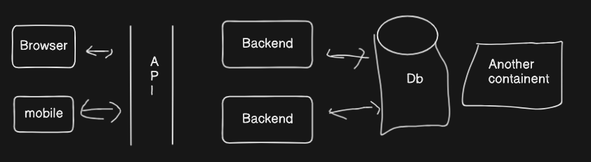

# Backend-Of-Js
####  File Structure in src
    index            App           Constants
    DB connect      config          enums,DB-name
                    cookie
    ->DB
    ->Model
    ->Controllers
    ->Routes
    ->Middlewares
    ->uttils(email sender)
    ->More(depends)

